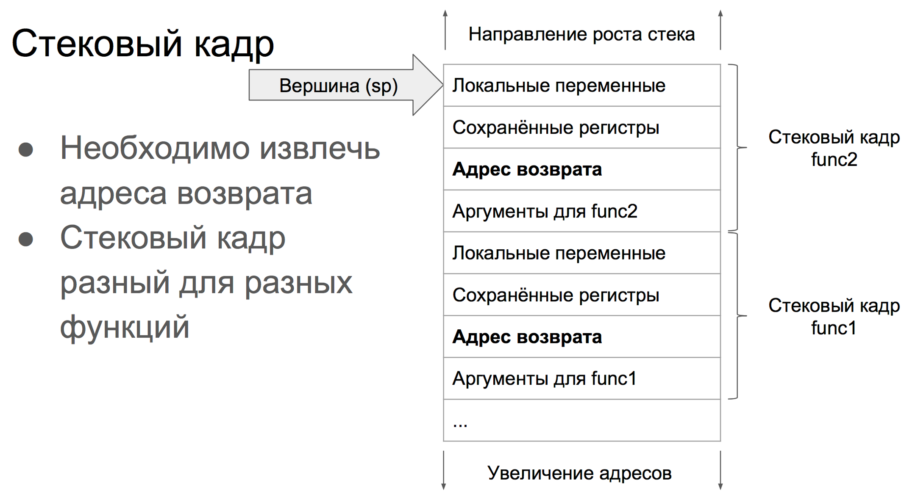
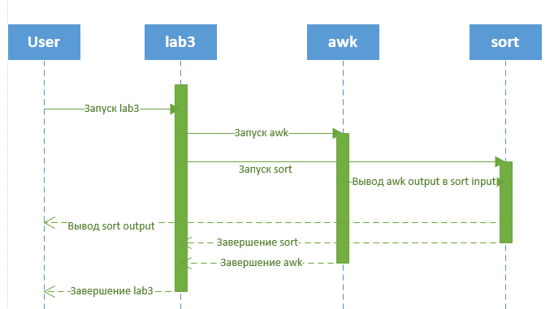

# Экзамен по ОСям

Будут сформированы “билеты” по 4 вопроса. Первый вопрос будет по практике с
требованием построить какую-либо диаграмму по практическому заданию. Остальные три
вопросы по теории из каждой аттестации (если у вас сдана та или иная аттестация, то вопрос
по этой аттестации Вам задаваться не будет). Те, кто не смог построить диаграмму не смогут
продолжить сдачу зачета.
На зачет обязательно приходить со сданной практикой. Сданная практика -
допуск к зачету.

## 1. В чем заключаются две основные функции операционной системы? Пояснить

1. Предоставление прикладным программистам (и прикладным программам, естественно) вполне понятный абстрактный набор ресурсов взамен неупорядоченного набора аппаратного обеспечения
2. Управление аппаратными ресурсами

## 2. В чем разница между системами с разделением времени и многозадачными системами?

Разделение времени — вариант многозадачности, при котором у каждого пользователя есть свой
диалоговый терминал. ЦП по очереди предоставляется нескольким пользователям, желающим работать на машине.

## 3. В чем разница между режимом ядра и пользовательским режимом? Объясните, как сочетание двух отдельных режимов помогает в проектировании операционных систем.

Большинство компьютеров имеют два режима работы: режим ядра и режим пользователя. Операционная система — наиболее фундаментальная часть программного обеспечения, работающая в режиме ядра (этот режим называют еще режимом супервизора). В этом режиме она имеет полный доступ ко всему аппаратному обеспечению и может задействовать любую инструкцию, которую машина в состоянии выполнить. Вся остальная часть программного обеспечения работает в режиме пользователя, в котором доступно лишь подмножество инструкций машины. В частности, программам, работающим в режиме пользователя, запрещено использование инструкций, управляющих машиной или осуществляющих операции ввода-вывода (Input/Output — I/O).

## 4. При создании операционных систем одновременно решаются задачи, например, использования ресурсов, своевременности, надежности и т. д. Приведите пример такого рода задач, требования которых могут протировечить друг другу.

* Многозадачность противоречит надежности. Чем больше программ работают одновременно, тем чаще между ними могут происходить конфликты, приводящие к "зависанию" компьютера.
* Дружественность противоречит простоте, поскольку достижение настоящей дружественности - это не простая, а сверхсложная задача
* Работоспособность в сети противоречит безопасности. С одной стороны мы хотим, чтобы наш компьютер мог запросто получать информацию со всего мира и общаться с другими компьютерами, а с другой строны, боимся, что вместе с информацией он может получить вирус.

## 5. Задача про время выполнения программ.

*Рассмотрим систему, имеющую два центральных процессора, у каждого из которых есть два потока (работающих в режиме гипертрейдинга). Предположим, есть три запущенные програмы: P0, P1 и P2 со временем работы 5, 10 и 20 мс соответственно. Сколько времени займет полное выполнение этих программ? Следует принять во внимание, что все три программы загружают центральный процессор на 100 %, не осуществляют блокировку во время выполнения и не меняют центральный процессор, назначенный для их выполнения.* 

Выполнение программ может занять 20, 25, 30 или 35 мсек в зависимости от того как операционная система назначит их выполнение. Если Р0 и Р1 назначены на одном и том же CPU, а Р2 на другом, то
программы выполнятся за 20 мсек. Если Р0 и Р2 назначены на один CPU, а Р1 на другом, то 25 мсек. Если Р1 и Р2 назначены на одном цп, а Р0 на другом, то 30 мсек. Если все три программы будут назначены на один цп то 35 мсек

## 6. Почему в системах разделения времени необходима таблица процессов? Нужна ли она в операционных системах персональных компьютеорв, работающих под управлением UNIX или Windows при единственном пользователе?

Таблица процессов содержит информацию о каждом процессе: открытые файлы, состояния регистров, и т.д. В системах с одним пользователем все равно куча одновременных процесов, и таблица процессов нужна.

## 7. С точки зрения программиста, системный вызов похож на вызов любой другой библиотечной процедуры. Важно ли программисту знать, какая из библиотечных процедур в результате приводит к системным вызовам? Если да, то при каких обстоятельствах и почему?

Системный вызов приводит к прерыванию текущего процесса, переходу в режим ядра, выполнению вызова и возврату к выполнению процесса. Это долго, и если производительность важна, то лучше избегать системных вызовов.

## 8. Виртуальные машины приобрели высокую популярность по различным причинам. И тем не менее у них имеется ряд недостатков. Назовите их. Поясните разницу между эмуляцией и виртуализацией.

**Недостатки:**

* Не все процессоры поддерживают

* Медленно

Виртуализатор или совсем не эмулирует(имитирует) реальную машину, её архитектуру и процессор или делает это вминимальном варианте для отдельных ресурсов.

Эмулятор - полностью или почти полностью реализует для исполнения кода отдельную машину со своей архитектурой и своими ресурсами. Вплоть до того, что может быть процессор совершенно другой архитектуры.

## 9. Инструкции, касающиеся доступа к устройствам ввода-вывода, обычно относятся к привилегированным инструкциям, то есть они могут выполняться в режиме ядра, но не в пользовательском режиме. Назовите причину привилегированнности этих инструкций.

Устройства ввода-вывода это аппаратные ресурсы машины. Ими управляет ядро.

Причины:

* безопасность ресурсов компьютера
* скорость обработки
* предоставление программистам нормального API для работы с вводом-выводом.

## 10. Предположим, вам нужно разработать новую компьютерную архитектуру, которая вместо использования прерываний осуществляет аппаратное переключение процессов. Какие сведения необходимы центральному процессору? Опишите возможное устройство аппаратного переключения процессов.

Аппаратное переключение процесса производится путем записи в регистры ЦП значений, образующих аппаратный контекст процесса. Так как в состав этих регистров входят и адресные регистры (например, сегментные регистры), то замена аппаратного контекста процесса приводит к замене полного контекста процесса, выполняемого на ЦП.

## 11. Когда в результате прерывания или системного вызова управление передается операционной системе, используется, как правило, область стека ядра, отделенная от стека прерываемого процеса. Почему?

1. Ядро не может доверять пользовательскому стеку, там может быть что угодно.
2. Ядро может оставлять чуствительные данные в стеке, доступ к которым пользовательской программе должен быть закрыт.

## 12. У компьютерной системы достаточно места, чтобы хранить в основной памяти пять программ. Половину своего времени эти программы простаивают в ожидании ввода-вывода. Какая доля процессорного времени при этом тратится впустую?

 $Степень\ загрузки\ ЦП =1-p^n=1-0.5^5=0.96875$

## 13. Представьте себе мультипрограммную систему со степерью 6 (то есть имеющую в памяти одновременно шесть программ). Предположим, что каждый процесс проводит 40% своего времени в ожидании ввода-вывода. Каким будет процент использования времени центрального процессора?

 $Степень\ загрузки\ ЦП =1-p^n=1-0.4^6=0.995904$

## 14. Может ли поток быть приостановлен таймерным прерыванием? Если да, то при каких обстоятельстваъ, а если нет, то почему?

Может. Если прерывания не отключены (если программа в критической области, например)

или

Таймерное прерывание останавливает весь процесс, а не поток.

## 15. В чем заключается самое большое преимущество от реализации потоков в пользовательском пространстве? А в чем заключается самый серьезный недостаток?

Можно реализовать в операционной системе, которая не поддерживает потоки (на данный момент - все). Потоки реализуются с помощью библиотеки.

Недостаток - реализация блокирующих системных вызовов.

## 16. Представьте себе систему реального времени с двумя голосовыми вызовами с периодичностью, равной 5 мс для каждого из них, со временем центрального процессора, затрачиваемого на каждый вызов, равным 1 мс, и с одним видеопо- током с периодичностью, равной 33 мс, со временем центрального процессора, затрачиваемого на каждый вызов, равным 11 мс. Можно ли спланировать работу такой системы?

Нет. За время обработки видео-вызова 11мс гарантированно придет аудио-вызов, который вызывается с периодичностью 5 мс.

Или да, ведь $\frac{1}{5}+\frac{1}{5}+\frac{11}{33}<1$, и общее время, необходимое процессу, больше того времени, которое может предоставить процессор.

## 17. Гибкая система реального времени имеет четыре периодически возникающих события с периодами для каждого, составляющими 50, 100, 200 и 250 мс. Предположим, что эти четыре события требуют 35, 20, 10 мс и x процессорного времени соответственно. Укажите максимальное значение x, при котором система все еще поддается планированию.

$$
\frac{35}{50}+\frac{20}{100}+\frac{10}{200}+\frac{x}{250}<=1
$$
$$
\frac{175+50+12.5+x}{250}<=1
$$
$$
237.5+x<=250
$$
$$
x<=12.5
$$

## 18. Системе реального времени необходимо обработать два голосовых телефонных разговора, каждый из которых запускается каждые 6 мс и занимает 1 мс процессорного времени при каждом использовании процессора, и один видеопоток со скоростью 25 кадров в секунду, где каждый кадр требует 20 мс процессорного времени. Поддается ли эта система планированию?

$$
\frac{1}{6}+\frac{1}{6}+\frac{20}{\frac{1000}{25}}
$$

$$
\frac{1}{3}+\frac{1}{2}<1
$$

Поддается.

## 19. Рассмотрите систему, в которой желательно разделить политику и механизм планирования потоков, реализованных на уровне ядра. Предложите средства для достижения этой цели.

Нужно наличие способа параметризации алгоритма планирования, предусматривающего возможность пополнение параметров со стороны пользовательских процессов. Чтобы родительский процесс мог всесторонне управлять планированием дочерних потоков, даже если сам планированием не занимаетяс. Механизм находится в ядре, а политика устанавливается пользователем.

## 20. Процессу, запущенному в системе CTSS, для завершения необходимо 30 квантов времени. Сколько раз он должен быть перекачан на диск, включая самый первый раз (перед тем, как он был запущен)?

Считывание процесса с диска, 1 квант, сброс
2 кванта, сброс
4 ванта, сброс
8 квантов, сброс
16 квантов, процесс выполнен.

Всего 4 перекачивания на диск. А может быть и 5, учитывая "самый первый раз, перед тем, как он был запущен", хотя в самый первый раз он перекачивался не НА диск а С диска. Или 6, если учитывать еще и последние перекачивание на диск, хотя че его перекачивать, ведь процесс уже завершен. 

Ответ: от 4 до 6.

## 21. В состоянии готовности к выполнению находятся пять заданий. Предполагаемое время их выполнения составляет 9, 6, 3, 5 и *x* . В какой последовательности их нужно запустить, чтобы свести к минимуму среднее время отклика? (Ответ будет зависеть от *x* .)

В порядке возрастания

## 22. Как в операционной системе, способной отключать прерывания, можно реализовать семафоры?

Слишком сложно, я хз

Чтобы провести операцию с семафорами, ОС сначала отключает прерывания. Затем считывает значение семафора. Если значение семафора равно нулю, то система помещает вызывающий процесс в список заблокированных процессов, связанный с семафором. Если нет - то идет проверка
на наличие заблокированных семафором процессов. Если один или более процесс заблокирован, то один из них удаляется из списка и запускается. После всех этих операций снова включаются прерывания.

## 23. Могут ли два потока, принадлежащие одному и тому же процессу, быть синхронизированы с помощию семафора, реализованного в ядре, если эти потоки реализованы на уровне ядра? Ответьте на тот же вопрос применительно к потокам, реализованным на уровне пользователя. Предполагается, что к семафору не имеют доступа никакие другие потоки любых других процессов. Обоснуйте свой ответ.

Чет тоже сложно, тут знать надо...

## 24. Объясните, как значение кванта времени и время переключения контекста влияют друг на друга в алгоритме циклического планирования.

Установка слишком короткого кванта времени приводит к слишком частым переключениям процессов и снижает эффективность использования центрального процессора, но установка слишком длинного кванта времени может привести к слишком вялой реакции на короткие интерактивные запросы.

## 25. Генерация сигналов

Из пользовательских программ:

- kill (2)
- sigsend(2)
- alarm(2)

Из ядра:

- от клавиатуры
- от ошибок программирования

## 26. sa_flags

Поле sa_flags  в struct  sigaction формируется побитовым ИЛИ следующих значений:

**A_ONSTACK** - Используется для обработки сигналов на альтернативном сигнальном стеке. 

**SA_RESETHAND** - Во время исполнения функции обработки сбрасывает реакцию на сигнал к SIG_DFL; обрабатываемый сигнал при этом не блокируется. 

**SA_NODEFER** - Во время обработки сигнала сигнал не блокируется. 

**SA_RESTART** - Системные вызовы, которые будут прерваны исполнением функции обработки, автоматически перезапускаются. 

**SA_SIGINFO** - Используется для доступа к подробной информации о процессе, исполняющем сигнальный обработчик, такой как причина возникновения сигнала и контекст процесса в момент доставки сигнала. 
**SA_NOCLDWAIT** - Подавляет создание процессов-зомби. 

**SA_NOCLDSTOP** - Подавляет генерацию SIGCHLD, когда порожденные процессы останавливаются или возобновляются. 

## 27. signal и sigset

Устанавливают адрес функции - обработчика сигнала

Системный вызов sigset аналогичен  вызову signal с важным дополнением: sigset позволяет  откладывать сигналы.

## 28. Алгоритм раскрутки стека


## 29. Сигналы для управления заданиями

| Имя     | Значение | Умолчание | Событие                              |
| ------- | -------- | --------- | ------------------------------------ |
| SIGSTOP | 23       | Stop      | Остановка (сигналом)                 |
| SIGTSTP | 24       | Stop      | Остановка  (пользователем)           |
| SIGCONT | 25       | Ignore    | Продолжение исполнения               |
| SIGTTIN | 26       | Stop      | Остановка  при  вводе  с терминала   |
| SIGTTOU | 27       | Stop      | Остановка  при  выводе  на  терминал |

## 30. Типы сигналов

POSIX определяет 28 сигналов, которые можно классифицировать следующим образом

| Название  | Код  | Действие по умолчанию      | Описание                                 | Тип              |
| --------- | ---- | -------------------------- | ---------------------------------------- | ---------------- |
| SIGABRT   | 6    | Завершение с дампом памяти | Сигнал посылаемый функцией `abort()`     | Управление       |
| SIGALRM   | 14   | Завершение                 | Сигнал истечения времени, заданного `alarm()` | Уведомление      |
| SIGBUS    | 10   | Завершение с дампом памяти | Неправильное обращение в физическую память | Исключение       |
| SIGCHLD   | 18   | Игнорируется               | Дочерний процесс завершен или остановлен | Уведомление      |
| SIGCONT   | 25   | Продолжить выполнение      | Продолжить выполнение ранее остановленного процесса | Управление       |
| SIGFPE    | 8    | Завершение с дампом памяти | Ошибочная арифметическая операция        | Исключение       |
| SIGHUP    | 1    | Завершение                 | Закрытие терминала                       | Уведомление      |
| SIGILL    | 4    | Завершение с дампом памяти | Недопустимая инструкция процессора       | Исключение       |
| SIGINT    | 2    | Завершение                 | Сигнал прерывания (Ctrl-C) с терминала   | Управление       |
| SIGKILL   | 9    | Завершение                 | Безусловное завершение                   | Управление       |
| SIGPIPE   | 13   | Завершение                 | Запись в разорванное соединение (пайп, сокет) | Уведомление      |
| SIGQUIT   | 3    | Завершение с дампом памяти | Сигнал «Quit» с терминала (Ctrl-\)       | Управление       |
| SIGSEGV   | 11   | Завершение с дампом памяти | Нарушение при обращении в память         | Исключение       |
| SIGSTOP   | 23   | Остановка процесса         | Остановка выполнения процесса            | Управление       |
| SIGTERM   | 15   | Завершение                 | Сигнал завершения (сигнал по умолчанию для утилиты kill) | Управление       |
| SIGTSTP   | 20   | Остановка процесса         | Сигнал остановки с терминала (Ctrl-Z).   | Управление       |
| SIGTTIN   | 26   | Остановка процесса         | Попытка чтения с терминала фоновым процессом | Управление       |
| SIGTTOU   | 27   | Остановка процесса         | Попытка записи на терминал фоновым процессом | Управление       |
| SIGUSR1   | 16   | Завершение                 | Пользовательский сигнал № 1              | Пользовательский |
| SIGUSR2   | 17   | Завершение                 | Пользовательский сигнал № 2              | Пользовательский |
| SIGPOLL   | 22   | Завершение                 | Событие, отслеживаемое `poll()`          | Уведомление      |
| SIGPROF   | 29   | Завершение                 | Истечение таймера профилирования         | Отладка          |
| SIGSYS    | 12   | Завершение с дампом памяти | Неправильный системный вызов             | Исключение       |
| SIGTRAP   | 5    | Завершение с дампом памяти | Ловушка трассировки или брейкпоинт       | Отладка          |
| SIGURG    | 21   | Игнорируется               | На сокете получены срочные данные        | Уведомление      |
| SIGVTALRM | 28   | Завершение                 | Истечение «виртуального таймера»         | Уведомление      |
| SIGXCPU   | 30   | Завершение с дампом памяти | Процесс превысил лимит процессорного времени | Исключение       |
| SIGXFSZ   | 31   | Завершение с дампом памяти | Процесс превысил допустимый размер файла | Исключение       |

## 31. Основные этапы разработки ОС с пояснением каждого этапа

1. Настройка среды разработки
2. Генезис (зарождение)
3. Экран
4. Таблицы GDT и IDT
   Это служебные таблицы в памяти, хранящие дескрипторы сегментов
5. Запросы на прерывания IRQ и таймер PIT (с программируемым интервалом)
6. Страничная организация памяти
7. Память типа куча
8. Файловая система VFS и initrd
9. Многозадачность
10. Пользовательский режим

## 32. Стековый кадр



## 33. Cxxabi + стандартный отладчик


## 34. Планирование процессов

Исходя из трех основных состояний процесса «готов», «выполнение», «заблокирован». Планировщик должен знать, какой процесс находится в каком состоянии. Все усложняется, если ЦП содержит несколько вычислительных ядер. Поэтому в ОС вводятся различные очереди (списки) для планирования процессов. 

Исходя из трех состояний процесса вводятся 3 очереди:

1. Очередь задач: множество всех процессов, которые есть в системе

2. Очередь готовых: множество всех процессов, готовых для выполнения, им можно в любой момент дать квант процессорного времени и они будут выполняться.

3. Очередь ожидающих: множество всех заблокированных процессов.


## 35. Управление процессами

* создание процесса – завершение процесса ;
* приостановка процесса (перевод из состояния исполнение в состояние готовность ) – запуск процесса (перевод из состоянияготовность в состояние исполнение );
* блокирование процесса (перевод из состояния исполнение в состояние ожидание ) – разблокирование процесса (перевод из состояния ожидание в состояние готовность ).

## 36. Процесс (физическое представление)


При запуске программы под процесс выделяется место в памяти. Адресное пространство, относящееся к процессу, делится на 3 части:

* Сегмент стека - используется для вызовов функций и системных вызовов
* Сегмента данных - переменные статические и динамические, выделяемые из кучи (все, что нужно для работы)
* Сегмент кода - код программы, обычно read-only

## 37. Структура управления процессами в ОС

* Таблица процессов
* Блок управления процессом - описывает свой процесс, которому он принадлежит, и его контекст
* Образ процесса - кусок памяти, выделенный для процесса

## 38. Записи таблицы процессов


## 39. Модель состояния процесса


## 40. Этапы создания процесса

1. Присвоение id
2. Выделение места
3. Инициализировать PCB (блок управления процессом)
4. Добавить процесс в очередь "готовых" к выполнению

## 41. Создание процесса ОС Unix

fork() - создает клон вызывающего процесса

exec() - создает клон вызывающего процесса и заменяет код на нужный процесс

## 42. Создание процесса ОС Windows

CreateProcess() - создает новый процес. Иерархии нет. Возвращает хэндл процесса.

## 43. Переключение контекста процесса

Старый процесс сохраняется в его PCB, новый загружается из его PCB

## 44. Параллелизм

Параллелизм – это физически одновременное выполнение для достижения наибольшей производительности(например, между двумя ядрами)

## 45. Потоки. Использование объектов потоками


## 46. Отличие потоков от процессов

* Процессы незасисимы, а потоки - составные элементы процессов
* Процессы несут больше информации о состоянии, а потоки совместно используют информацию о состоянии
* Процессы имеют отдельное адресное пространство, а у потоков свое - только стек
* Процессы взаимодействуют только через предоставляемые системой механизмы связи
* Переключение контекста между потоками в процессе быстрее, чем переключение контекста между процессами

## 47. Потоки на пользовательском уровне, потоки, управляемые ядром


## 48. Иерархия процессов

В Unix есть иерархия процессов. Каждый процесс имеет родителя. Самый главный - init.

## 49. Память без использования абстракций. Свопинг. Уплотнение памяти.

Память без абстракций - программа просто видит физическую память. Реальные адреса. Работа двух программ невозможна. Хотя можно запилить многопоточную прогу, у них память одна.

Свопинг - сохранение всей проги на диск, и запуск другой проги. Замена данных. Так можно обеспечить работу двух программ без абстракций памяти.

Уплотнение памяти - перемещение всех программ, расположенных в разных местах в оперативке в нижние адреса.

## 50. Адресное пространство

Это список адресов ячеек памяти, куда процесс может писать данные.

## 51. Этап компиляции загрузки и выполнения

- Этап компиляции (Compile time). Когда на стадии компиляцииизвестно точное место размещения процесса в памяти, тогда непосредственногенерируются физические адреса. При изменении стартового адреса программынеобходимо перекомпилировать ее код. 
- Этап загрузки (Load time). Если информация о размещениипрограммы на стадии компиляции отсутствует, компилятор генерирует перемещаемыйкод. В этом случае окончательное связывание откладывается до моментазагрузки. Если стартовый адрес меняется, нужно всего лишь перезагрузить код сучетом измененной величины.
- Этап выполнения (Execution time). Если процесс может бытьперемещен во время выполнения из одной области памяти в другую,с вязывание откладывается до стадиивыполнения. Здесь желательно наличие специализированного оборудования, напримеррегистров перемещения. Их значение прибавляется к каждому адресу,сгенерированному процессом. Большинство современных ОС осуществляет трансляциюадресов на этапе выполнения,используя для этого специальный аппаратный механизм.

## 52. Диспетчер памяти

Штука, которая преобразует виртуальные адреса в физические.


## 53. Запись таблицы страниц

Точный формат зависит от конструкции машины.


## 54. Преобразование виртуального адресного пространства в физическое

Реальный адрес ищется в таблице страниц. Если там стоит флаг отсутствия, то управление передается ОС, она сбрасывает редко-используемый кусок памяти на диск, и загружает с диска нужный кусок, меняет флаг отсутствия на флаг присутствия и заново запускает прерванную команду.

## 55. Повтор вопроса 22

## 56. Повтор вопроса 23

## 57. Повтор вопроса 24

## 58. Повтор вопроса 13

## 59. Повтор вопроса 14

## 60. Повтор вопроса 15

## 61. Что такое модульная ОС?

ОС, в которой каждый модуль вынесен в отдельную часть, хранится в отдельной области в памяти, и не падает, если упадет соседний модуль.

## 62. Рассказать про разные ассемблеры

* a86 — хороший ассемблер, но не бесплатный, и если вы не заплатите, то32-битный код писать не сможете — только DOS.
* gas свободно доступен и портирован под DOSи Unix, но разработан для обратной совместимости с gcc. Поэтому проверка ошибок минимальна, к тому-же, с точки зрения любого, кто попробовал что-либо написать в нем — синтаксис ужасен. Плюс ко всему вы не можете в нем написать 16-разрядный код (по крайней мере, правильно).
* as86 — только подLinux и (по крайней мере моя версия) кажется не имеет практически никакой документации.
* MASM очень хорош, очень дорог и работает только под DOS.
* TASM лучше, но все еще борется сMASM за совместимость, что означает миллионы директив и куча волокиты. Его синтаксис — по существу MASM-овский, но с противоречиями и причудами (в некоторой степени удаляемыми посредством режима Ideal). Он также дорогой и тоже — только ДОС.
* NASM - типа GAS, но с синтаксисом от intel

## 63. Какой мем стоит на 22 слайде презентации "Разработка ОС"


## 64. Операционной системы: понятие, функции, примеры

Это комплекс программ, обеспечивающих возможность рационального использования ресурсов компьютера.

- Предоставление прикладным программистам (и прикладным программам, естественно) вполне понятный абстрактный набор ресурсов взамен неупорядоченного набора аппаратного обеспечения
- Управление аппаратными ресурсами

## 65. Эволюция операционных систем

1. (1945-1955) электронные лампы
2. (1955-1965) транзисторы и системы пакетной обработки
3. (1965-1980) интегральные схемы и многозадачность
4. (1980-наши дни) персональные компьютеры
5. (1990-наши дни) мобильные компьютерыц

## 66. Операционные системы: понятие, классификации

ОС классифицируются по:

* количеству пользователей
* однозадачные/многозадачные
* однопроцессорные/многопроцессорные
* разрядность
* тип интерфейса
* тип доступа пользователя к ЭВМ: с пакетной обработкой, с разделением времени, реального времени
* тип использования ресурсов: сетевые, локальные

## 67. Схематично опишите решение 4 практической задачи

Поток санты блокируется до тех пор, пока к нему не постучатся олени, а после, блокируется поток оленей, пока их не отпустит санта. И все заново

## 68.  Напишите на ассемблере Hello World

```gas
.data
	hello_str:
		.string "Hello, world!\n"
.text
	.globl _main
_main:
	movl $4, %eax //$4 - системный вызов write, перемещаем его номер в регистр eax
	movl $1, %ebx //Перемещаем в регистр ebx () номер потока вывода - $1 - stdout
	movl $hello_str, %ecx //Переме 
	movl $14, %edx
	int $0x80
	
```

## 69. Управление памятью с помощью побитовых матриц

Память делится на блоки, этим блокам соответствует бит в матрице, который показывает, свободна память, или нет. Если нужно много памяти, то нужно искать в матрице большую последовательность нулей. Это долго, не всегда возможно, и кароч все пользуются связными списками.

## 70. Повтор вопроса 25

## 71. Повтор вопроса 26

## 72. Повтор вопроса 27

## 73. Повтор вопроса 28

## 74. Повтор вопроса 29

## 75. Повтор вопроса 30

## 76. Повтор вопроса 32

## 77. Опишите два свойства модели Биба

1. Простое свойство целостности (The simple integrity property) — процесс, работающий на уровне безопасности k, может записывать только в объекты своего или более низкого уровня (никакой записи наверх).
2. Свойство целостности * (The integrity * principle) — процесс, работающий на уровне безопасности k, может читать из объектов своего или более высокого уровня (никакого чтения из нижних уровней).

## 78. Опишите два свойства модели Белла - Лападулы

1. Простое свойство безопасности (The simple security property) — процесс, запущенный на уровне безопасности k, может проводить операцию чтения только в отношении объектов своего или более низкого уровня. К примеру, генерал может читать документы лейтенанта, но лейтенант не может читать генеральские документы.
2. Свойство * (The * property) — процесс, работающий на уровне безопасности k, может вести запись только в объекты своего или более высокого уровня. К примеру, лейтенант может добавить сообщение в генеральский почтовый ящик, докладывая обо всем, что ему известно, но генерал не может добавить сообщение в лейтенантский почтовый ящик, сообщая о том, что известно ему, поскольку генерал может быть ознакомлен с совершенно секретными документами, содержание которых не должно доводиться до лейтенанта.

## 79. Средства защиты должны точно выполнять свои функции и быть изолированы от пользователя. Должны ли они выполняться в виде отдельного модуля, и если да, то какого?

Защитные механизмы должны быть просты, постоянны и встроены в нижний слой системы, это не аддитивные добавки (известно много неудачных попыток "улучшения" защиты слабо приспособленной для этого ОС MS-DOS).
Все системные вызовы проходят через монитор обращений для проверки безопасности.

Однако есть всякие антивирусы, брандмауэры. Они работают в виде отдельного модуля.

Кароч на нижних уровнях защита должна быть на уровне ядра, а на высоких можно и отдельно.

## 80. Опишите принцип минимальных полномочий

(Principle of Least Authority (POLA)), или принцип необходимого
знания. В общем, безопасность проще соблюсти, когда у каждого домена имеется ми-
нимум объектов и привилегий для работы с ними и нет ничего лишнего.

## 81. Операции с каталогами

- **Create** (Создать каталог). Каталог создается пустым, за исключением точки и двойной точки, которые система помещает в него автоматически (или в некоторых случаях при помощи программы mkdir).
- **Delete** (Удалить каталог). Удалить можно только пустой каталог. Каталог, содержащий только точку и двойную точку, рассматривается как пустой, поскольку они не могут быть удалены.
- **Opendir** (Открыть каталог). Каталоги могут быть прочитаны. К примеру, для вывода имен всех файлов, содержащихся в каталоге, программа ls открывает каталог для чтения имен всех содержащихся в нем файлов. Перед тем как каталог может быть прочитан, он должен быть открыт по аналогии с открытием и чтением файла.
- **Closedir** (Закрыть каталог). Когда каталог прочитан, он должен быть закрыт, чтобы освободить пространство во внутренних таблицах системы.
- **Readdir** (Прочитать каталог). Этот вызов возвращает следующую запись из от крытого каталога. Раньше каталоги можно было читать с помощью обычного системного вызова read, но недостаток такого подхода заключался в том, что программист вынужден был работать с внутренней структурой каталогов, о которой он должен был знать заранее. В отличие от этого, readdir всегда возвращает одну запись в стандартном формате независимо от того, какая из возможных структур каталогов используется.
- **Rename** (Переименовать каталог). Во многих отношениях каталоги подобны файлам и могут быть переименованы точно так же, как и файлы.
- **Link** (Привязать). Привязка представляет собой технологию, позволяющую файлу появляться более чем в одном каталоге. В этом системном вызове указываются существующий файл и новое имя файла в некотором существующем каталоге и создается привязка существующего файла к указанному каталогу с указанным новым именем. Таким образом, один и тот же файл может появиться в нескольких каталогах, возможно, под разными именами. Подобная привязка, увеличивающая показания файлового счетчика i-узла (предназначенного для отслеживания количества записей каталогов, в которых фигурирует файл), иногда называется жесткой связью, или жесткой ссылкой (hard link).
- **Unlink** (Отвязать). Удалить запись каталога. Если отвязываемый файл присутствует только в одном каталоге (что чаще всего и бывает), то этот вызов удалит его из файловой системы. Если он фигурирует в нескольких каталогах, то он будет удален из каталога, который указан в имени файла. Все остальные записи останутся. Фактически системным вызовом для удаления файлов в UNIX (как ранее уже было рассмотрено) является unlink.

## 82. Преимущества и недостатки непррерывного размещения файлов

Простейшая схема размещения заключается в хранении каждого файла на диске в виде
непрерывной последовательности блоков.

### Преимущества

1. Его **просто реализовать**, поскольку отслеживание местонахож-
   дения принадлежащих файлу блоков сводится всего лишь к запоминанию двух чисел:
   дискового адреса первого блока и количества блоков в файле. При наличии номера
   первого блока номер любого другого блока может быть вычислен путем простого
   сложения.
2. У него превосходная **производительность** считывания, поскольку весь файл
   может быть считан с диска за одну операцию.

### Недостатки

1. **Фрагментация**

## 83. Преимущества и недостатки размещщения файлов непрерывным списком

Первое слово каждого блока используется в качестве указателя на следующий блок, а вся остальная часть блока предназначается для хранения данных.

### Преимущества

1. Может быть использован каждый дисковый блок, потери на фрагментацию отсутствуют

### Недостатки

1. Медленна

## 84. Запись каталога файловой системы MS-DOS


## 85. Запись каталого файловой системы UNIX


## 86. Структура файловой системы

Что структура? Что нужно сделать? Описать? Которую нужно описать? Структуру в Linux?

Ну чаще всего так: В начале MBR, потом таблица разделов, в начале каждого раздела загрузочный блок.


## 87. Повтор вопроса 27

## 88. Loopback

Петля, че. Замыкание на себя. Откуда инфа вылазит, туда и попадает.

## 89. Какие требования предъявляют к долговременному хранению информации?

1. Оно должно предоставлять возможность хранения огромного количества информации.
2. Информация должна пережить прекращение работы использующего ее процесса.
3. К информации должны иметь одновременный доступ несколько процессов.

## 90. Сколько существует подходов к определению прав доступа и какие?

1. Домены защиты
2. Списки управления доступом
3. Перечни возможностей

## 91. Схематично изообразите файловую структуру

Да я хз че имеется в виду под этим вопросом.

## 92. Схема структуры двоичных файлов

Файл на рис. 4.1, а представляет собой бессистемную последовательность байтов. В сущности, операционной системе все равно, что содержится в этом файле, — она видит только байты. Какое либо значение этим байтам придают программы на уровне пользователя. Такой подход спользуется
как в UNIX, так и в Windows.


Или вот так:


## 93. Диаграммы последовательностей, состояний и деятельности для всех практических задач

### Последовательность, задача 3



### Состояния, задача 3


### Деятельность, задача 3


### Последовательность, задача 4


### Последовательность, задача 5


### Последовательность, задача 6


## 94. Диаграмма взаимодействия, развертывания для всех практических задач

TODO

## 95. PTHREAD (схемы обязательны)

Стандартизированное API для работы с потоками в UNIX.


## 96. 2 схематичное решение задачи обедающие философы

Если справа и слева не едят, то можно взять обе вилки и начать есть. А потом положить.

## 97. Fuse (схема обязательна)

Fuse - filesystem in userspace — «*файловая система в пользовательском пространстве*» — свободный модуль для ядер Unix-подобных операционных систем, позволяет разработчикам создавать новые типы файловых систем, доступные для  монтирования пользователями без привилегий


## 98. API (схема взаимодействия). API сокетов

API — набор готовых классов, процедур, функций, структур и констант, предоставляемых приложением или операционной системой для использования во внешних программных продуктах. Используется программистами при написании всевозможных приложений.

Для использования сокетов в UNIX разработчикам предоставляется API сокетов Беркли:

**socket()** - создаёт конечную точку соединения и возвращает дескриптор

**gethostbyname()**, **gethostbyaddr()** - возвращают описание интернет-узла

**connect()** - устанавливает соединение с сервером

**bind()** - связывает сокет с адресом

**listen()** - подготавливает сокет к принятию входящих соединений

**accept()** - принимает запрос на установление соединения

## 99. GAS и NASM, различия

Одним из основных различий между NASM и GAS является синтаксис. В GAS используется относительно старый синтаксис AT&T, характерный для GAS и некоторых старых ассемблеров, тогда как NASM использует синтаксис Intel, поддерживаемый большинством ассемблеров, в том числе ASM и MASM. (Современные версии GAS поддерживают директиву .intel_syntax, которая позволяет использовать синтаксис Intel в GAS)

## 100. puts

Что блять puts? Что мне нужно ответить? 
Функция. Выводит строку типа char* в stdout, добавляет \n в конце.

Ни разу не пользовался.

## 101. Gcc

Что блять gcc? Что это за вопрос, в котором одно слово?
Программа. Набор компиляторов. Можно скомпилировать прогу на *C* этой штукой. И прогу на каком то ассемблере.

## 102. Повтор вопроса 95


